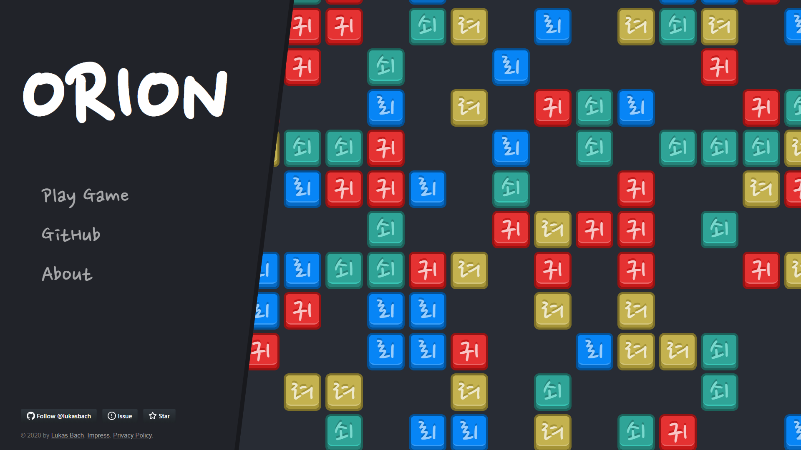
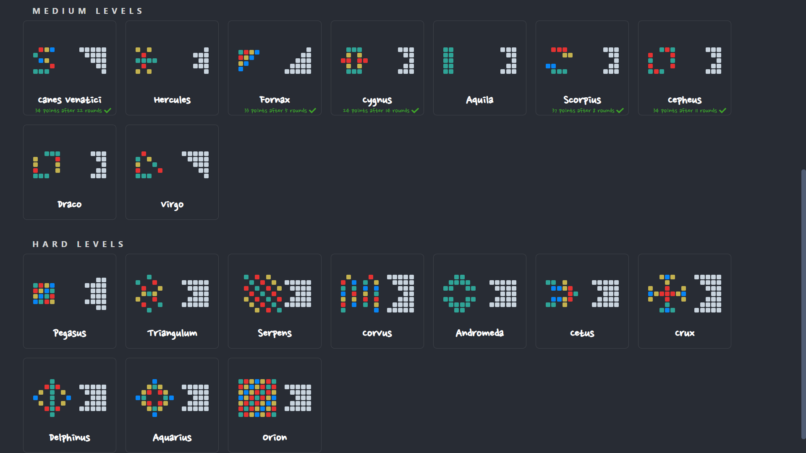
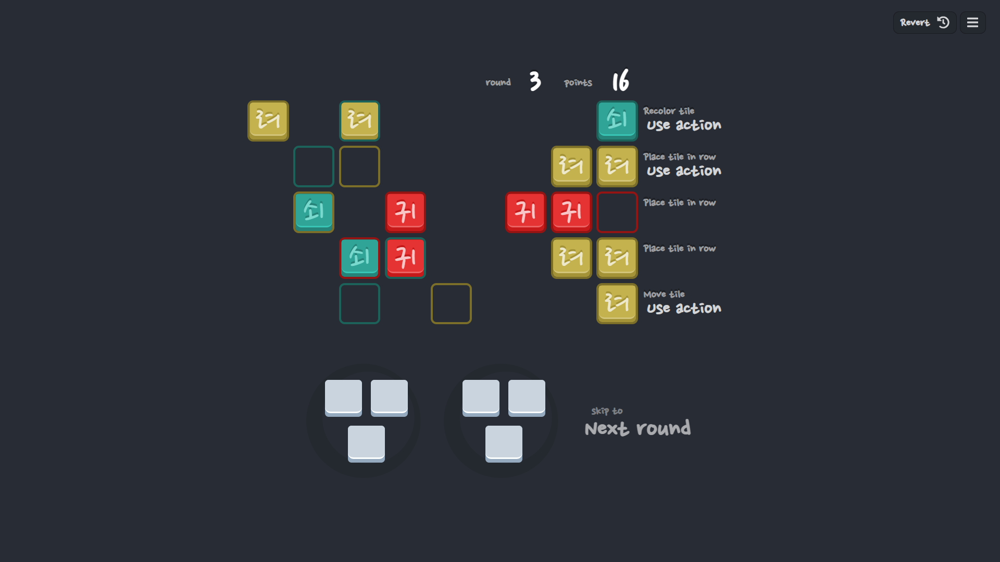
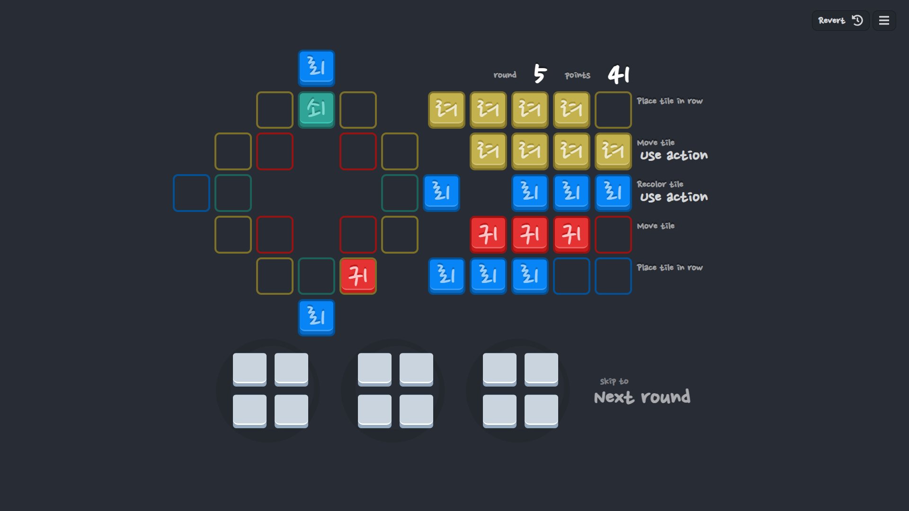

# ORION Game

> Play at https://orion.lukasbach.com

Orion is a free singleplayer board game inspired by the board game Azul. 
The goal is to fill the board with tiles in specific colors by cleverly 
choosing tiles from bags and arranging them in banks.

Start by playing the tutorial levels to get a grip of how the game works.
The levels only take about five minutes to play through, then you can play
through more challenging levels.

Currently featuring more than 30 distinct and challenging levels, Orion
gives you lots of brain teasers to play through.

